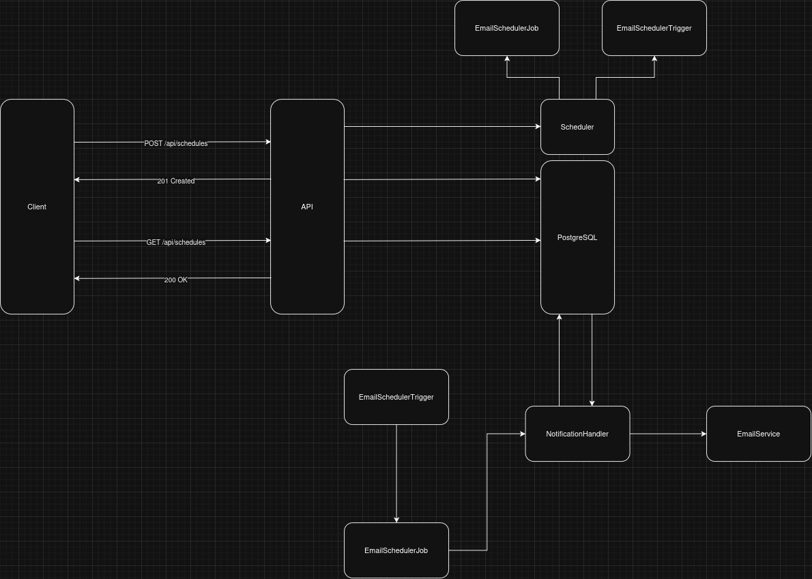

# 📬 Async Email Scheduler API

Uma API assíncrona simples desenvolvida para o agendamento e disparo de e-mails em segundo plano. O projeto utiliza o Quartz.NET para o gerenciamento de tarefas (jobs), Entity Framework Core para persistência de dados no PostgreSQL e Mailkit para a comunicação com servidores SMTP.

---

## 🛠️ Tecnologias Utilizadas

* .NET 10 Core
* Quartz.NET
* MediatR
* Mailkit & MimeKit
* Entity Framework Core
* PostgreSQL
* Scalar / OpenAPI

---

---

| Método | Endpoint | Descrição | Payload |
|----------|----------| ---------| ---------|
| POST   | /api/schedules/   | Cria um novo agendamento | *201 CREATED* |
| GET   | /api/schedules/   | Lista os Agendamentos | *200 OK* |

